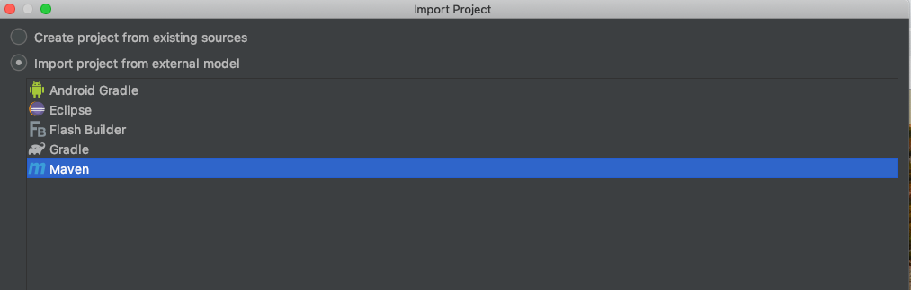
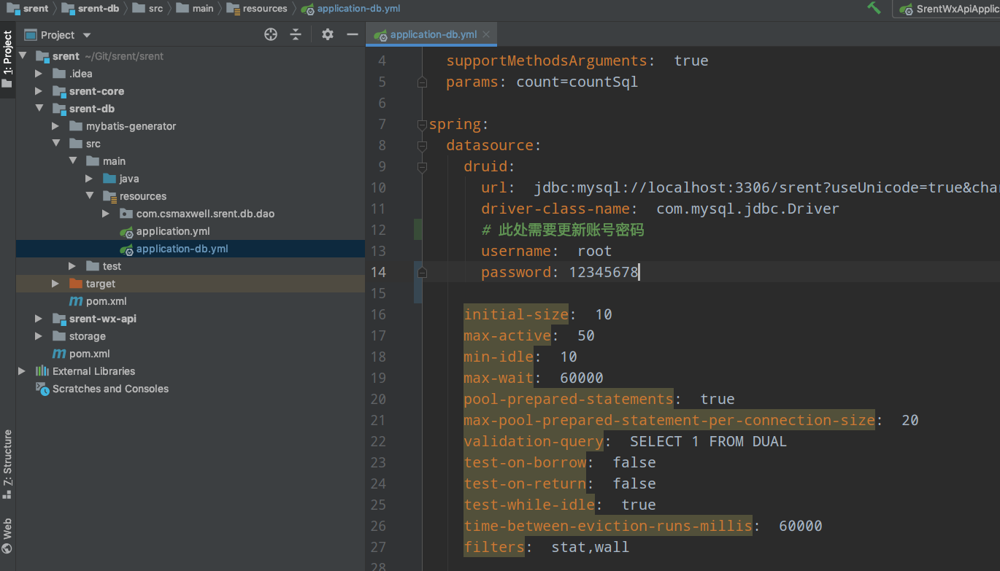
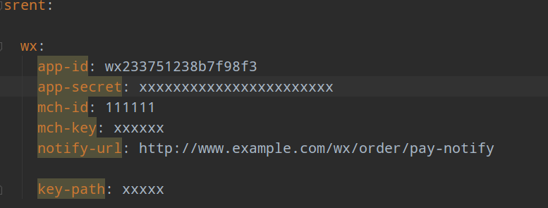
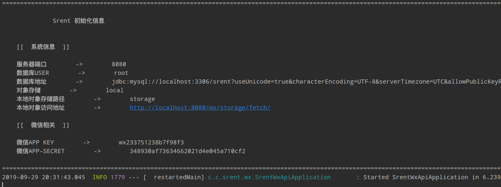
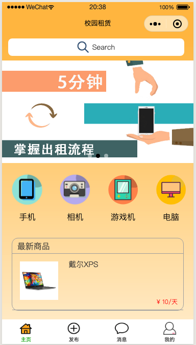

# srent


A WeChat Mini Program for campus rentals. The frontend is built using the WeChat Developer Tools and a few ColorUI components, while the backend is powered by Spring Boot. The admin panel is constructed with Vue and ElementUI.

#### Quick Start

1. ##### Create a new database named `srent`, and import the database file (`srent-db/sql/srent.sql`). 

    Example: `mysql -u -p srent < srent.sql`

2. ##### Open the `srent` folder in an IDE and modify some configurations:

    Example: IntelliJ IDEA

    Select "Import Project", import the project build tool, and choose Maven.

    

		Click "Next" until Maven finishes downloading the required JAR dependencies, then you will need to modify a few items.	



Modify `application-db.yml` located in `srent-db/src/main/resources` to update the database username, password, and other connection details.

Next, modify `application-core.yml` in the `srent-core` resources directory. Update the `app-id` and `app-secret` with your WeChat Developer credentials, which can be found in the WeChat Developer Console.



Next, open `srent-wx-api/src/main/java/com/csmaxwell.srent.wx/SrentWxApiApplication`. This is the project's startup class. Run it. If the console output looks similar to the example below, everything is running correctly.



3. ##### Set up the Admin Panel

    Open a terminal in the `srent-admin` directory and enter:

    ```shell
    cnpm install
    cnpm run dev
    ```

    
    4. ##### Set up the Mini Program

    Open the WeChat DevTools, select "Import Project", choose the `rent` folder, change the AppID to the `app-id` you configured earlier in IntelliJ IDEA (otherwise, WeChat login will fail), and then proceed with the import.

    Edit `config/api.js` to update the API endpoints that communicate with the backend.

    If everything goes smoothly, the project setup is complete, and you can now start making modifications.

    

    

    If you have any questions, feel free to open an issue.
