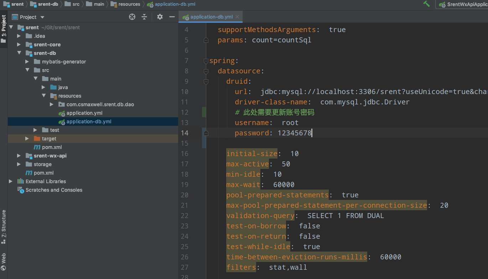
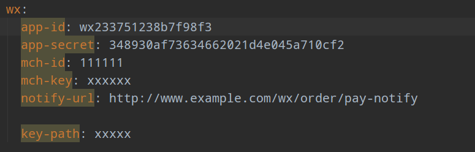
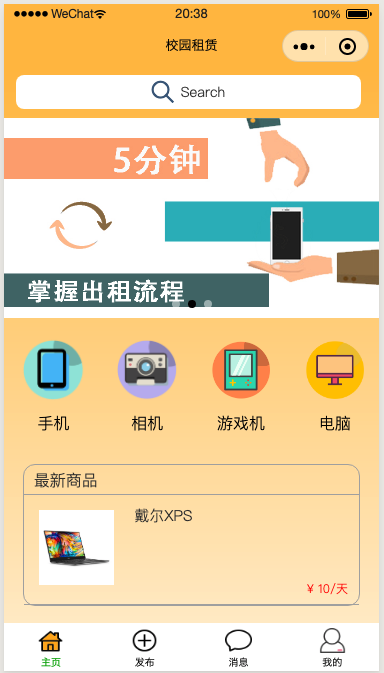

# srent

一个校园租赁微信小程序，前端由微信开发工具以及少量的colorui组件完成，后端由Spring Boot完成。

这个程序照搬了 [litemall](https://github.com/linlinjava/litemall) 的很多代码，自己再修修改改完成的，这里补充的不足，请去 [litemall 的文档](https://linlinjava.gitbook.io/litemall/)查看。

#### 快速启动

1. 在数据库中新建一个名字为 srent 的数据库，使用 srent.sql导入表与数据 

    例：mysql -u -p srent < srent.sql

2. 将srent文件夹使用IDE打开，并修改一些配置：

    例：IDEA

    选择 Import Project，导入工程的构架工具，选择maven

    

​		一直下一步，等待 maven 下载好依赖的 jar 包，接着需要修改几个地方	

修改 srent-db 下的 src -> main -> resources 下的application-db.yml 修改其中的数据库账号密码等信息

接着修改 srent-core 下的 resources 的 application-core.yml，将 app-id 与 app-secret 修改为自己的微信开发id与secret，这个id与secret在微信开发设置里面查看。

接着打开 srent-wx-api -> src -> main -> java -> com.csmaxwell.srent.wx -> SrentWxApiApplication 这个类就是项目的启动类，运行这个类，运行输出大概是这个样子，说明没有什么问题了

3. 设置小程序

    打开微信小程序开发工具，选择导入项目，选择 rent 文件夹，将 AppID 改为刚才在IDEA中设置的 app-id，否则不能微信登录，接着选择导入

    在 config -> api.js 中，编辑与后端接收的接口。

    到这里如果一切顺利，项目已经导入完成了，接下来就可以进行修改了。

    

有什么问题，欢迎在Issus中提出。